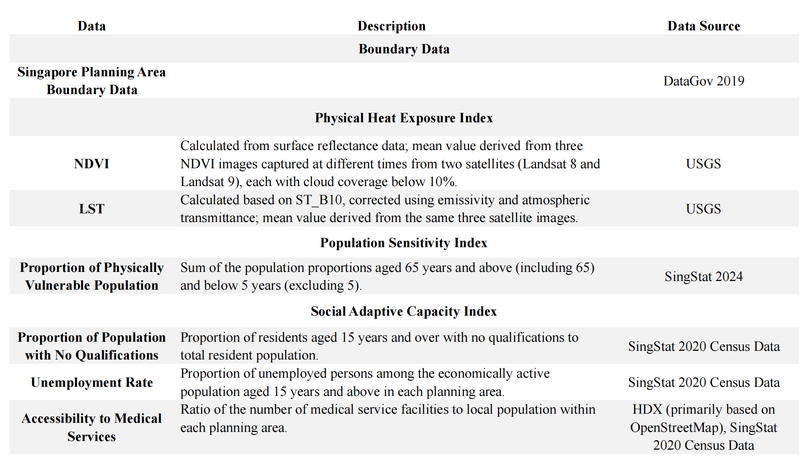

class: background,center,middle
```{r setup, include=FALSE}
options(htmltools.dir.version = FALSE)
library(knitr)
#remotes::install_github("ropensci/RefManageR")
library(RefManageR)
library(knitcitations)
library(DiagrammeR)
BibOptions(check.entries = FALSE,
           bib.style = "authoryear",
           cite.style = "authoryear",
           style = "markdown",
           hyperlink = TRUE,
           dashed = FALSE,
           no.print.fields=c("doi", "url", "urldate", "issn"))
myBib <- ReadBib(here::here("references.bib"), check = FALSE)

```
#**Problem:context & background**

---

##Singapore suffers from the persistent Urban Heat Island effect, leading to <span style="color:#FF5733;">rising health risks</span>, <span style="color:#FF5733;">soaring energy consumption</span>, and <span style="color:#FF5733;">worsening environmental degradation</span>.

```{r echo=FALSE, out.width='48%',fig.show='hold'}
knitr::include_graphics('image_heat2.png')
```
```{r echo=FALSE, out.width='48%',fig.show='hold'}

```

<center>Source: [Strategies for Cooling Singapore](https://www.research-collection.ethz.ch/handle/20.500.11850/258216) and [ARUP](https://www.arup.com/news/singapores-built-environment-traps-heat-in-surprising-places/) 

---
# Location & Climate
<div style="display: flex; align-items: flex-start; justify-content: space-between;">

  <!-- 文本部分 -->
  <div style="width: 55%; text-align: left;">
    <p>Singapore is located near the <span style="color:#FF5733;"> equator </span> and experiences a <span style="color:#FF5733;"> tropical rainforest climate</span>, with high temperatures and humidity year-round (typically 26-34°C).</p>
    <p>Due to its equatorial location, Singapore receives <span style="color:#FF5733;"> intense solar radiation </span> throughout the year, making it inherently prone to <span style="color:#FF5733;"> high urban temperatures</span>.</p>
  </div>

  <!-- 图片部分 -->
  <div style="width: 45%;">
    
  </div>

</div>

<center>Source:[Mughal et al., 2020](https://www.sciencedirect.com/science/article/pii/S2212095520303333)
---
#Problem statement
* Studies indicate that urban temperatures in Singapore are <span style="color:#FF5733;">4-7°C higher</span> than in rural areas, with the most significant UHI effects occurring at night.

* The most affected areas include the *CBD, Kallang-Geylang region, and industrial zones* (Chatterjee et al., 2019).

* Research also shows that night time surface temperatures in Singapore are higher than daytime temperatures due to <span style="color:#FF5733;">heat retention by buildings and roads, which slowly release stored heat overnight</span> (Wong & Chen, 2009).

```{r echo=FALSE, out.width='60%',fig.align='center'}
knitr::include_graphics('image_state.png')
```
<center>Source:[Cooling Singapore](https://ethambassadors.ethz.ch/2018/12/13/cooling-singapore-meets-new-york-city/)
---
#Impact
```{r echo=FALSE, out.width='60%',fig.align='center'}

```
<p style="text-align: center;">
Source: <a href="https://www.civilengineeringweb.com/2022/07/urban-heat-island-effect.html">What is Urban Heat Island Effect</a>
</p>

```{r xaringan-panelset, echo=FALSE,}
xaringanExtra::use_panelset()
```
.panelset[
.panel[.panel-name[Environmental]  

**Increased air pollution**  
**Worsening Aquatic System** 
**Increasing heavy rainfall and heightening flood risks in low-lying areas**
**Higher water consumption and reduced water resources.**  
**Making survival more challenging for animals**
]
.panel[.panel-name[Economic]
**putting pressure on electricity systems**  
**Greater energy use for cooling**  
Studies show that for every 1°C increase, air conditioning energy consumption rises by 4-5% (Santamouris, 2015).  
**Increasing cost of cooling adds to the economic burden**
**Gross domestic product (GDP) declines.**

]
.panel[.panel-name[Social]
**Social inequality intensifies**
**Leading to an increase in heat-related crimes, such as violent crimes and theft**  
**Increasing the incidence of heatstroke, heat stress, and cardiovascular diseases**  
**Nighttime high temperatures affect sleep quality, increasing residents' stress and anxiety.**  

]

]

---
class: background,center,middle
#**Policies**


---
# Global Development Goals
Challenge: Cities need to improve compliance with development plans to align with global frameworks.

.panelset[
.panel[.panel-name[SDGs]

[The 2030 Agenda for Sustainable Development(SDGs)](https://sdgs.un.org/2030agenda)
The 17 SDGs offer the most practical and effective pathway to tackle the causes of climate change and environmental degradation.


.left-column[
SDG 11  SUSTAINABLE CITIESAND COMMUNITIES  
Make cities and human settlements inclusive, safe, resilient and sustainable  

```{r, echo=FALSE, out.width='40%', fig.align='center'}

```

]

.right-column[
SDG 13 CLIMATEACTION  
Take urgent action to combat climate change and its impacts  

```{r, echo=FALSE, out.width='40%', fig.align='center'}

```
]
]

.panel[.panel-name[NUA]
[The New Urban Agenda(NUA)](https://unhabitat.org/sites/default/files/2019/05/nua-english.pdf) provides a global framework for sustainable urban development. It emphasizes the integration of urban planning, resilience, and environmental sustainability to enhance compliance with international development goals.  


1.3.2 Resilience and adaptation to climate change (NUA 80,NUA 67)  

1.3.3 Climate change mitigation(NUA 143,NUA 79)
	
]

.panel[.panel-name[The Sendai Framework]
[Sendai Framework for Disaster Risk Reduction 2015-2030](https://www.undrr.org/publication/sendai-framework-disaster-risk-reduction-2015-2030) outlines    

(i) Understanding disaster risk; (ii) Strengthening disaster risk governance to manage disaster risk; (iii) Investing in disaster reduction for resilience and; (iv) Enhancing disaster preparedness for effective response, and to "Build Back Better" in recovery, rehabilitation and reconstruction.  

•	Priority 3: Investing in disaster risk reduction for resilience  
  
• Priority 4: Enhancing disaster preparedness for effective response and to "Build Back Better" in recovery, rehabilitation and reconstruction.
]

.panel[.panel-name[Beating the Heat]  

[Beating the Heat: A Sustainable Cooling Handbook for Cities](https://www.unep.org/resources/report/beating-heat-sustainable-cooling-handbook-cities) 
The new guide serves as a comprehensive resource for planners, providing a wide range of proven strategies for urban cooling and assisting cities in identifying the most suitable approach for their specific contexts.

It highlights a holistic approach to **sustainable cooling**, identifies **barriers to temperature reduction**, and provides guidelines for **developing a cooling actionplan**.
]  

.panel[.panel-name[CRF]  

[City Resilience Framework (CRF)](https://resilientcitiesnetwork.org/city-resilience-framework/)

**Health & Wellbeing**   
•1. Safe, adequate & affordable housing  

**Infrastructure & Environment**  

•12. Healthy ecosystems, green spaces & biodiversity  

•14. Sustainable transport & active mobility  

**Local Governance & Planning**  

•19. Robust municipal finance & city management 

]

]

---
# National / Metropolitan plans
#### Singapore is concerned about the effects of the urban heat island and climate change.

.panelset[
.panel[.panel-name[Singapore’s Master Plan 2019]  

Liveable and Inclusive Communities  

**More Greenery & Play Spaces**  
•Complementing Recreation with Green & Blue Options  
•Landscaping Developments with Green & Blue Features (Like Skyrise Modification Project)
  	
**A Sustainable and Resilient City of the Future**   
•Adapting to Climate Change (Ensuring Thermal Comfort)
  	

**limitations**
Relies on voluntary business actions without strong regulatory enforcement
]

.panel[.panel-name[Singapore Green Plan 2030]  
**2026 targets**  
Develop over 130 ha of new parks, and enhance around 170 ha of existing parks with more lush vegetation and natural landscapes  

**2030 targets**  
plant 1 million more trees across Singapore  

Increase nature parks’ land area by over 50% from 2020 baseline 

Every household will be within a 10-minute walk from a park  

**2035 targets**  
Add 1000 ha of green spaces
]
.panel[.panel-name[Draft Master Plan 2025]  

Liveable and Inclusive Communities  

**Strengthen Urban Resilience**  
  	
1.	Protecting against the effects of climate change and responding nimbly to any crisis  

```{r echo=FALSE, out.width='60%', fig.align='center'}

```
]

]
---
# Local plans

**More green space:** Singapore’s 2011 Open Space Provisioning, Parks and Trees Act 2005, Nature Conservation Master Plan, ABC Waters Programme   
**More green building:** Nature Conservation Master Plan(GM: 2021), Skyrise Greenery Incentive Scheme, Landscaping for Urban Spaces and High-Rises (LUSH)  
**Related scientific research:** Cooling Singapore Project
## limitations  
**Social Equity in Climate Adaptation:**  
Addressing Heat Vulnerability Among Low-Income Communities and Outdoor Workers
Protecting Elderly, Children, and At-Risk Communities in Urban Climate Adaptation  

**Public Engagement in Urban Cooling:**  
Community Awareness Programs and Corporate Incentives for Sustainable Practices  

**Policy Evaluation and Adaptive Governance:**  
Annual Urban Heat Mitigation Assessment and Long-Term Monitoring Strategies


---

class: background,center,middle
#**Data and Methods**

---
# Data

---
## Data Overview
### Remote Sensing Data

[Source: USGS](https://earthexplorer.usgs.gov/)

---
### Distribution of Medical Service Facilities and Boundary Data

---
#Heat Vulnerability Assessment

1. Calculate the mean values of NDVI and LST for each planning area.

2. Normalize all indicators using <span style="color:#FF5733;"> Min-Max scaling</span>. For indicators negatively correlated with heat vulnerability (e.g., NDVI), use the transformed value (1 – NDVI').
```{r echo=FALSE, fig.align='center',out.width='30%'}

```

3. Assume equal contribution of all variables to heat vulnerability (<span style="color:#FF5733;">all variables have equal weights</span>). Sum all normalized variables to obtain the Urban Heat Vulnerability (UHV) index.
---
# Visualization

.pull-left[
## Map 1
#### Physical Heat Exposure Map (30 m)
Illustrates the spatial distribution of urban heat exposure, effectively identifying high-risk areas (low vegetation cover, high-temperature zones).

```{r echo=FALSE, fig.align='center',out.width='85%'}

```
]
.pull-right[
## Map 2
#### Heat Vulnerability Map (planning area)
Used to identify which areas exhibit higher heat vulnerability and thus require prioritized heat mitigation measures (e.g., increasing green spaces, improving ventilation corridors, limiting traffic volume, and pavement reconstruction).

]
---
# Flowchart

---
# Example of Result
`r invisible(Citet(myBib, "philipp2020urban"))`

```{r echo=FALSE, fig.align='center',out.width='85%'}

```
[Source: SEC](https://sec.ethz.ch/research/cs/research.htm)
---
#Reference
```{r results='asis', echo=FALSE}

PrintBibliography(myBib)
```
